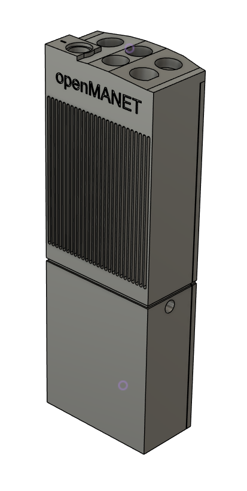

# Open Not 5 Node Enclosure

## Overview

This enclosure is designed for OpenMANET field nodes and integrates a Raspberry
Pi 4B with an internal battery-backed UPS. The aluminum chassis doubles as a
passive heatsink and keeps all I/O accessible through waterproof bulkhead ports.
The enclosure can also be 3D printed, but thermal performance may be reduced.

Printable files and additional build notes are available on
[MakerWorld](https://makerworld.com/en/models/2128181-openmanet-radio-case).

## Assembly

1. Print the enclosure files or prepare the aluminum chassis.
2. Install the required heat-set inserts.
3. Mount the Raspberry Pi 4B, WM1302 Pi HAT, WM6180 module, and UPS.
4. Install the 18650 cells and complete the power wiring.
5. Install the waterproof Ethernet port, antenna pigtails, and antennas.
6. Verify operation and seal the enclosure.

## Bill of Materials

Based on OutlawLabs document `BOM-OMNT-001`, revision `1.0`, dated
April 28, 2026.

### Core Electronics

| Qty | Component | Specification / Source |
|-----|-----------|------------------------|
| 1 | Raspberry Pi 4 Model B | 1 GB RAM minimum; ARM Cortex-A72; USB 3.0; Gigabit Ethernet |
| 1 | SD card | Class 10 / A1 recommended; 16 GB minimum |
| 1 | Wio WM6180 Wi-Fi HaLow module | Mini PCIe; 802.11ah; sub-1 GHz |
| 1 | WM1302 Pi HAT | LoRaWAN gateway HAT for Raspberry Pi; SPI interface |
| 1 | CAZN RJ45 Ethernet port | [Panel-mount RJ45 connector](https://s.click.aliexpress.com/e/_c3y8oRGt) |

### RF and Antennas

Choose either antenna option A or B for the 868 / 915 MHz radio.

| Qty | Component | Specification / Source |
|-----|-----------|------------------------|
| 1 | Option A: Mesh Ant | [868 / 915 MHz; 2 dBi; BNC; ZBM2 Industries](https://zbm2industries.com/products/mesh-ant) |
| 1 | Option B: Mesh Goose Neck antenna | [868 / 915 MHz; 2 dBi; BNC; ZBM2 Industries](https://zbm2industries.com/products/mesh-goose-neck?_pos=1&_sid=85e2e1a47&_ss=r) |
| 1 | SMA-F to BNC-M adapter | [Required for antenna option A or B](https://zbm2industries.com/products/sma-f-to-bnc-m) |
| 1 | GPS antenna: Mesh Stubby | [GPS / GNSS compact stub; ZBM2 Industries](https://zbm2industries.com/products/mesh-stubby?variant=45259893833880) |
| 1 | U.FL to SMA-K pigtail cable | 1.13 mm coax; 120 mm length; U.FL / IPEX connector |

### Power System

| Qty | Component | Specification / Source |
|-----|-----------|------------------------|
| 1 | Waveshare 3S UPS HAT | 3-cell 18650 UPS; USB-C; I2C fuel gauge; 5 V output |
| 1 | USB-C FPC charging cable | [USB-C male soft-flat charging cable, available in 2-pin / 3-pin resistor variants](https://a.aliexpress.com/_mPbpBKL); select the correct variant for the build |
| 3 | 18650 rechargeable batteries | 3.7 V nominal; 2500 mAh minimum; protected cells recommended |

### Fasteners and Inserts

| Qty | Component | Specification |
|-----|-----------|---------------|
| 14 | M3 screws | Stainless steel; length TBD per assembly drawing |
| 4 | M3 bolts | Stainless-steel hex bolts |
| 10 | M3 heat-set threaded inserts | Brass; M3 x 5 mm OD x 5 mm L; press-fit for 3D print |
| 8 | M2.5 screws | Stainless steel; length TBD per assembly drawing |
| 8 | M2.5 heat-set threaded inserts | Brass; M2.5 x 3.5 mm OD x 5 mm L; press-fit for 3D print |
