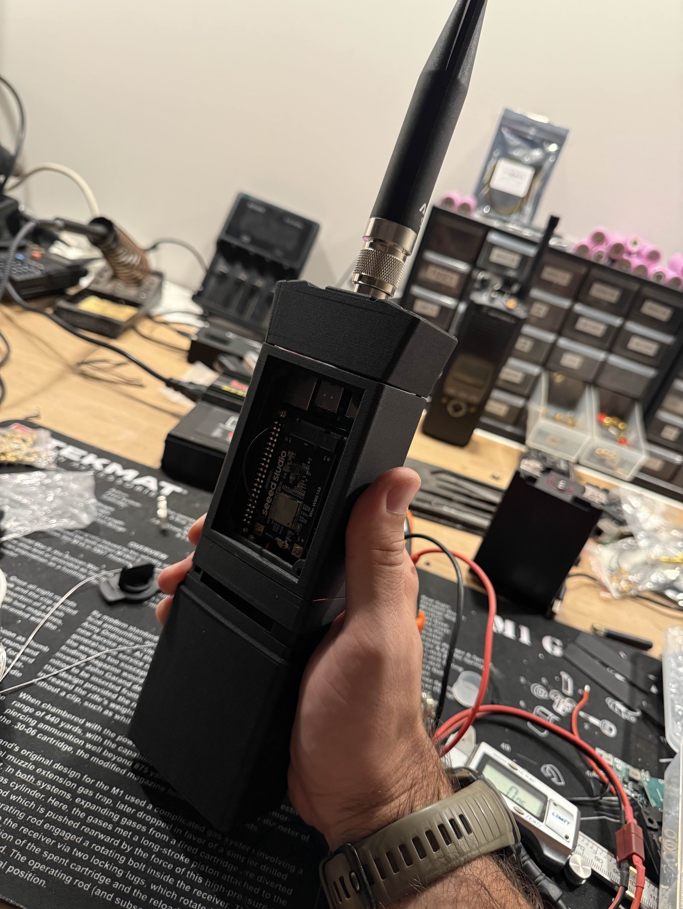
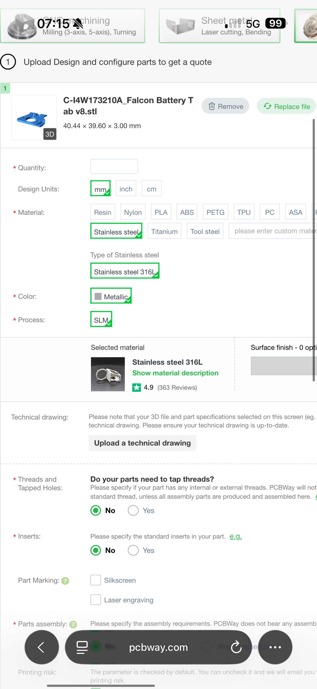
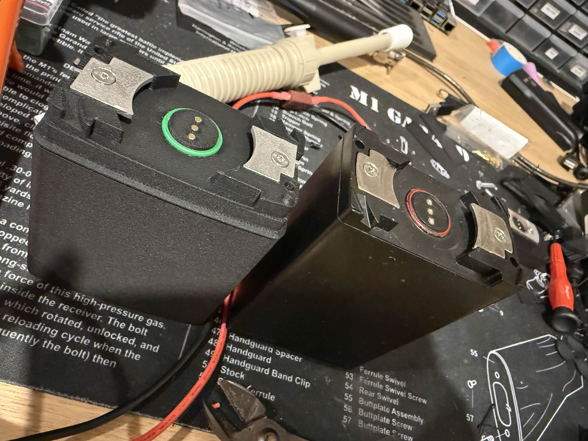
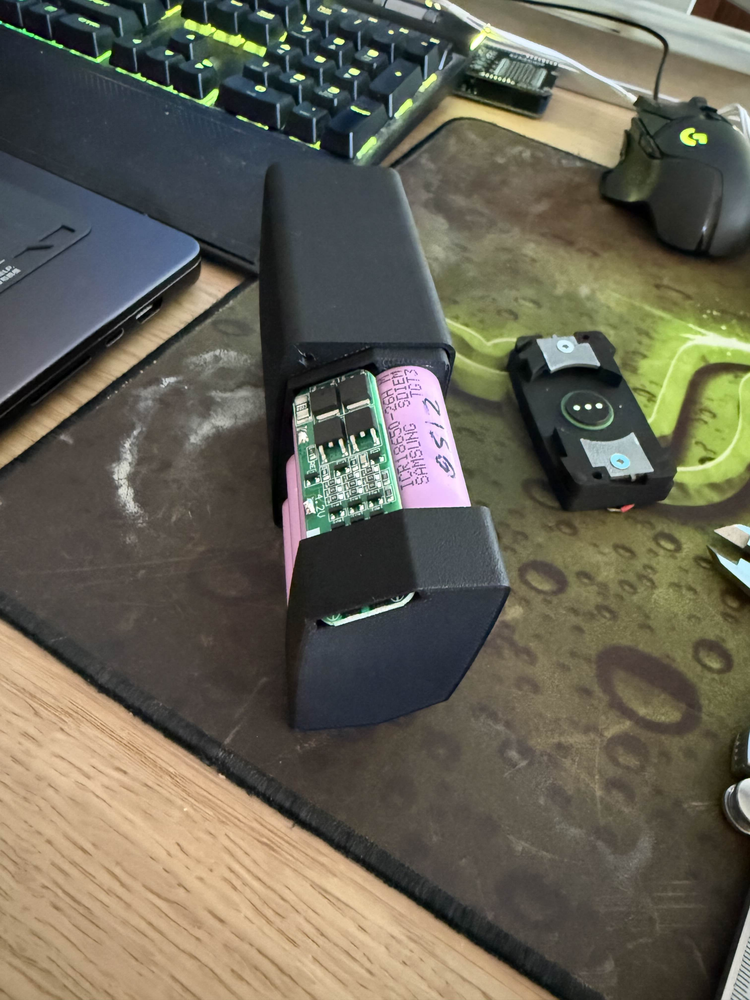

# PRC-148 / PRC-152 Battery

DIY rechargeable battery enclosure and radio-side mounting interface for
PRC-148 / PRC-152-style OpenMANET radios. The battery uses six 18650 cells in a
3S2P configuration and copies the nominal voltage and twist-lock interface of a
PRC-148 battery.

This is an early community design by Mark. The recovered source files and known
build details are collected here so the design can be tested, documented, and
improved.

> [!CAUTION]
> Building lithium-ion packs can cause fire, serious injury, or property damage.
> Use matched, genuine cells; a suitable 3S BMS; insulated weldable battery
> tabs; a current-limited spot welder; and a charger specifically intended for a
> 3S lithium-ion pack. Verify polarity, isolation, and pack voltage before
> connecting the battery to a radio.

## Status

The original prototype has been built and operated, but this is not yet a
complete, independently verified build guide. See [Open Questions](#open-questions)
before ordering parts or assembling a pack.

The interface is intended to accept genuine-style PRC-148 batteries as well.
Mark reported that an original battery physically fitted, but genuine-battery
electrical compatibility has not been independently verified.

The optional interface PCBs are also prototype hardware. In the June 2026
discussion, board revision `0.1` had been ordered but had not yet been reported
as electrically validated. Review the KiCad source and verify every net before
connecting a battery or radio.

## Electrical Specification

| Item | Specification |
|------|---------------|
| Cell type | 6 x 18650 lithium-ion cells |
| Cell configuration | 3S2P |
| Nominal pack voltage | 10.8 V |
| Maximum pack voltage | 12.6 V |
| Prototype cell capacity | Approximately 3400-3500 mAh per cell |
| Approximate pack capacity | 6800-7000 mAh, depending on cells |
| Protection / balancing | 3S BMS |
| Charging | Standard 12.6 V 3S lithium-ion charger through the top connector |
| Positive contacts | Two outer circular contacts |
| Data contact | Middle circular contact; routed through the optional interface PCBs but unused by the basic battery |
| Ground contacts | Both stainless-steel twist-lock tabs, connected to protected BMS output negative |
| Positive contact rating | Mark reports 2-3 A at 12 V per pin; two positive pins are used in parallel |

The BMS balance connections must be connected at the 4.2 V and 8.4 V series
nodes. Each node joins the corresponding parallel cell pair. Do not treat these
as optional outputs.

Mark's prototype was charged using an inexpensive generic 12.6 V 3S
lithium-ion charger. A charging dock can use the same mechanical interface as
the radio-side mount. A commercial `SN-832-KIT Rev B` charging-adapter STEP file
was shared in Discord as a mechanical reference, but it is not included here
because its redistribution license is unknown.

The interface PCBs do not convert the pack voltage. The radio still requires a
separate regulator or power supply suitable for its electronics. An MP1584EN
module was used elsewhere in Mark's prototype, but Mark described it as
temporary and community discussion identified RF-emission concerns.

## Mechanical Interface

The two stainless-steel tabs are both structural twist-lock features and
electrical ground contacts. Their angled surfaces tighten the battery against
the radio as the battery rotates into place. They must be conductive and cannot
be replaced with plastic prints.

Mark's prototype used SLM-printed 316L stainless-steel tabs. He reported a cost
of about USD $10 per pair. His PCBWay reference settings for the older
`Falcon Battery Tab v8` were:

| Item | Setting |
|------|---------|
| Dimensions | 40.44 x 39.60 x 3.00 mm |
| Material | Stainless steel 316L |
| Process | SLM |
| Threads / inserts | None |

Mark subsequently modified the tab to fit countersunk pieces, so do not treat
the `v8` dimensions as the final production model. Sheet metal may also work if
it can be formed accurately, but that approach has not been documented or
verified here.

The center contact arrangement is:

| Side | Contact |
|------|---------|
| Radio | 6 mm spring-loaded pogo pins |
| Battery | 2.0 x 7.0 mm flat-top pins, 1.5 mm body, no spring |

The pins are pushed in from the top with a tight friction fit. The prototype's
printed holes required minor drilling. Solder quickly to avoid heat damage;
wire-wrapping the pin before soldering is recommended.

An O-ring seals the circular contact insert. Mark specified `13.9 x 1.8 mm`.

## Related Electronics

The companion [mattronix/battery-board](https://github.com/mattronix/battery-board)
project replaces point-to-point wiring at the mechanical interface with two
PCBs.

### Battery-Side PCB

The battery board connects the BMS/output harness to the contacts and adds one
resettable fuse before the two parallel positive contacts.

| JST XH 3-pin | Signal | Destination |
|--------------|--------|-------------|
| Pin 1 | `GND` | Both conductive twist-lock tabs |
| Pin 2 | `DATA` | Middle flat contact |
| Pin 3 | Raw `VBAT+` | Resettable fuse, then both outer positive contacts |

Connect the BMS protected output positive and negative to this harness. The
board's fuse protects the positive contacts, but it does not replace the 3S BMS.

### Radio-Side PCB

The radio board combines the two positive pogo pins, passes them through an
always-on P-channel MOSFET reverse-polarity stage, then through a 5 mOhm shunt.
An INA226 measures bus voltage and current across that shunt. The board does not
regulate the battery voltage.

| JST XH 6-pin | Signal | Purpose |
|--------------|--------|---------|
| Pin 1 | `GND` | Ground / both conductive twist-lock tabs |
| Pin 2 | `DATA` | Direct pass-through from the middle battery contact |
| Pin 3 | `SDA` | INA226 I2C data |
| Pin 4 | `SCL` | INA226 I2C clock |
| Pin 5 | `3V3` | Host-supplied INA226 power |
| Pin 6 | `VBAT+` | Monitored/protected battery output |

The middle `DATA` contact is independent of the INA226. INA226 telemetry uses
the separate `SDA` and `SCL` harness pins and requires host software. The
current design grounds both INA226 address pins and leaves its alert output
unconnected.

The PCB project is licensed separately under CERN-OHL-W-2.0.

> [!WARNING]
> The board repository's prose documentation has described the INA226 as
> reporting over the battery `DATA` line. The current KiCad design does not do
> that: `DATA` is a separate pass-through, while the INA226 uses `SDA` and `SCL`
> on the radio-side six-pin harness.

## Bill of Materials

| Qty | Part | Known specification / source | Notes |
|-----|------|------------------------------|-------|
| 6 | 18650 cells | Matched 3.6 V nominal cells | Prototype used 3400-3500 mAh cells |
| 1 | 3S BMS | [Original AliExpress listing](https://www.aliexpress.com/item/1005009778488275.html) | Confirm current rating and wiring before assembly |
| 3 | Radio-side spring contacts | [6 mm pogo pin listing](https://www.aliexpress.com/item/1005006095992803.html) | Used on radio side |
| 3 | Battery-side flat contacts | [Original listing](https://www.aliexpress.com/item/32862727404.html) | 2.0 x 7.0 mm, 1.5 mm body, no spring |
| 1 | O-ring | 13.9 x 1.8 mm | Circular contact insert seal |
| 2 | Conductive twist-lock tabs | SLM-printed 316L stainless steel | Both tabs are ground contacts |
| 1 set | Cell interconnects | Weldable battery tabs sized for expected current | Mark welded tabs to the cells, then soldered cables to the tabs; confirm tab material |
| 1 set | Wire and insulation | Sized for expected current and pack voltage | Include fish paper / equivalent cell insulation |
| 1 | 3S lithium-ion charger | 12.6 V CC/CV charger | Connects through top interface |
| 1 set | Fasteners / inserts | To be confirmed | See Open Questions |
| Optional | Battery and radio interface PCBs | [mattronix/battery-board](https://github.com/mattronix/battery-board) | Adds contact breakout, battery-side resettable fuse, radio-side reverse-polarity protection, and INA226 monitoring |

## Source Files

### Battery

The [`cad/battery`](cad/battery) directory contains:

- `Battery Case` Fusion 360 and STL files
- `BatteryTop v1` Fusion 360 and STL files
- `18650 Holder Top` Fusion 360 and STL files
- `18650 Holder Bottom` Fusion 360 and STL files
- `Falcon Battery Tab v12` conductive twist-lock tab STL
- `PRC Cell.3mf` prepared multi-part print project

### Radio

The [`cad/radio`](cad/radio) directory contains the matching
`148_152_Radio_Bottom` Fusion 360 and STL files.

Only an STL is currently available for the conductive `Falcon Battery Tab v12`;
an editable F3D or STEP source would make fabrication changes easier.

## Assembly Outline

1. Print and dry-fit all battery parts and the radio-bottom counterpart.
2. Obtain or manufacture the conductive stainless-steel twist-lock tabs.
3. Install the flat battery-side contacts and O-ring in the battery top.
4. Build a matched 3S2P cell pack using a spot welder and suitable insulation.
   Mark spot-welded tabs to the cells and then soldered cables to the tabs. Do
   not solder directly to bare cells.
5. Wire both parallel groups to the BMS, including the 4.2 V and 8.4 V balance
   nodes.
6. If wiring without the battery-side PCB, connect both outer circular contacts
   to BMS protected output positive and leave the middle data contact unused.
   If using the PCB, connect BMS protected output positive to JST pin 3; the
   board's resettable fuse feeds both positive contacts.
7. Connect both conductive twist-lock tabs to BMS protected output negative,
   not directly to raw cell negative. With the battery-side PCB, use JST pin 1.
8. Leave battery-board JST pin 2 / the middle `DATA` contact disconnected unless
   implementing a compatible battery-side data system. It is not used for
   INA226 monitoring.
9. Verify there are no shorts between positive, data, ground tabs, or exposed
   fasteners.
10. Confirm correct polarity and pack voltage with a multimeter before mating
    the battery to the radio.
11. Perform initial charge and load testing in a fire-resistant location.

## Open Questions

The following details need confirmation before this can be considered a
repeatable build guide:

- Editable `Falcon Battery Tab v12` CAD, preferably F3D or STEP. The available
  STL is `v12`; the recovered fabrication-reference screenshot is for the older
  `v8` tab.
- Exact screws, heat-set inserts, and fastener lengths.
- Verified BMS model, current rating, protection thresholds, and complete wiring
  diagram.
- Recommended cell model, continuous current rating, nickel-strip dimensions,
  wire gauge, and battery-board resettable-fuse rating.
- Confirmed polarity diagram viewed from both the battery and radio sides.
- Recommended print material, orientation, layer height, walls, and infill.
- Environmental sealing and water-resistance test results.
- Mechanical fit across different PRC-148 / PRC-152 reproduction bodies.
- Final charging-dock design and safe charging procedure.
- Radio-side harness integration, INA226 software support, and validation of the
  MOSFET/shunt path at the intended continuous and peak currents.

## License

Licensing for Mark's original CAD and photos needs confirmation from Mark before
redistribution. This repository otherwise uses its root
[CC BY-NC 4.0 license](../LICENSE). Do not assume GPL applies to these files
until the creator explicitly selects and grants that license.
