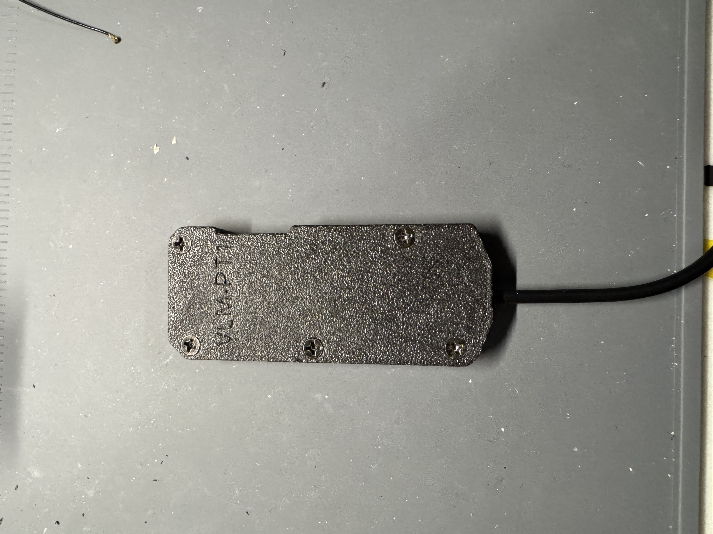
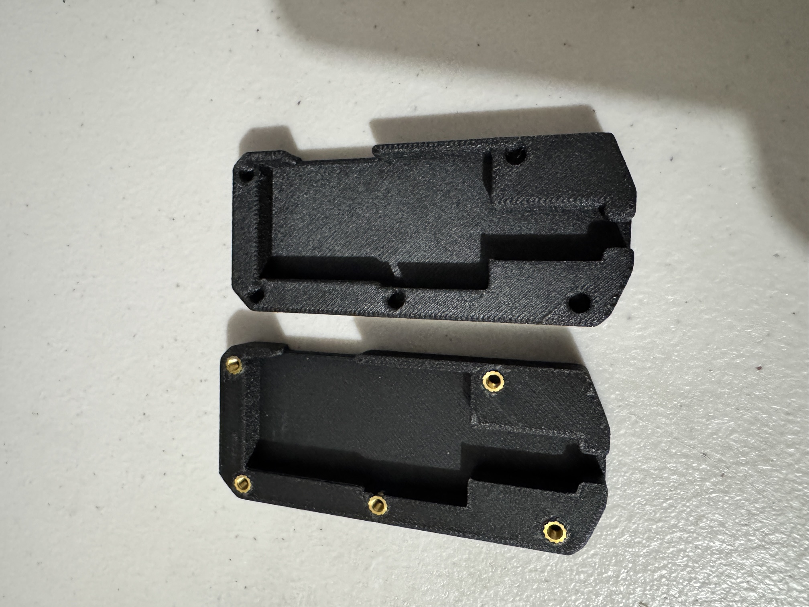
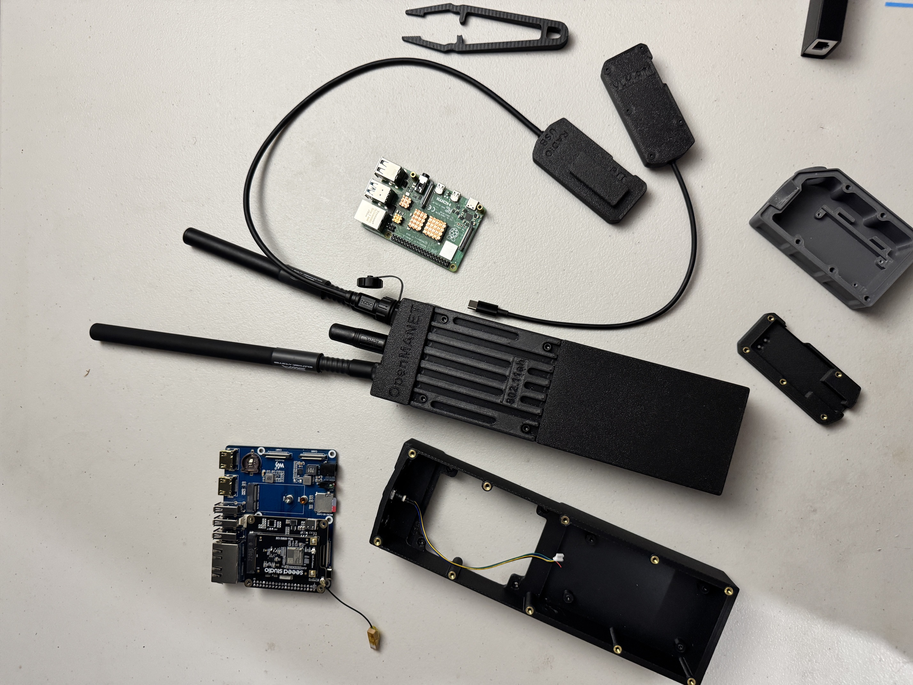

# Sunkworks VLM-PT1 Enclosure

Compact two-piece enclosure for the OpenVLM VLM-KW USB voice/PTT interface.

## Overview

- Fits the [Builds By Shane VLM-KW board](https://www.buildsbyshane.com/shop/p/product-3-szb2y-gzh2r-tzhkx-xahl8).
- Uses five heat-set inserts and five flat-head screws.
- Routes the USB and Kenwood-style PTT cables through opposite ends of the case.
- The included STL contains both enclosure halves.

A ready-made [Sunkworks VLM-PT1 enclosure kit](https://sunkworkstec.com/products/sw-vlm-pt1)
is printed in PPA-CF and includes mounting hardware and one selected USB cable.
The VLM board and PTT are sold separately.

## Photos

## Bill of Materials

| Qty | Item | Notes |
|-----|------|-------|
| 1 | VLM-KW board | Purchased separately |
| 1 | Printed VLM-PT1 enclosure | Both halves are in the included STL |
| 5 | M3 x 3 mm heat-set inserts | Install in the enclosure bosses |
| 5 | M3 x 6 mm flat-head Phillips screws | Join the enclosure halves |
| 1 | USB host cable | Match the connector to the host device |
| 1 | Compatible Kenwood 2-pin PTT | Purchased separately |

## Printing

1. Import [`stl/vlm-pt1-enclosure.stl`](stl/vlm-pt1-enclosure.stl).
2. Split the model into its two shell components.
3. Move the shells apart and orient each one separately for printing.
4. Confirm that the heat-insert bosses print cleanly before assembly.

## Assembly

1. Print and clean both enclosure halves.
2. Install the five M3 x 3 mm heat-set inserts, keeping them square and flush.
3. Dry-fit the VLM-KW board and route the USB and PTT cables through the case
   openings without pinching them.
4. Join the shells with the five M3 x 6 mm screws and tighten only until the seam
   closes.
5. Test the VLM before field use.

## Source Files

- [`stl/vlm-pt1-enclosure.stl`](stl/vlm-pt1-enclosure.stl) — both enclosure halves
- [`hardware/parts.txt`](hardware/parts.txt) — original fastener and cable notes
- [`pics/`](pics) — assembly and context photos

## Related Links

- [Sunkworks VLM-PT1 enclosure kit](https://sunkworkstec.com/products/sw-vlm-pt1)
- [OpenMANET/OpenVLM repository](https://github.com/OpenMANET/OpenVLM)
- [Builds By Shane VLM-KW board](https://www.buildsbyshane.com/shop/p/product-3-szb2y-gzh2r-tzhkx-xahl8)

## License

Repository content is covered by the root
[CC BY-NC 4.0 license](../LICENSE). The OpenVLM board and software repositories
carry their own licenses; review those projects before redistributing their
files.
